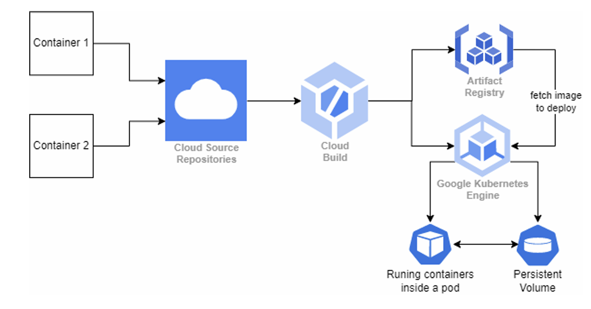

# Cloud-Native CI/CD Pipeline and GKE Deployment

This project implements a **Cloud-Native CI/CD pipeline** to deploy microservices on **Google Kubernetes Engine (GKE)** using **Terraform** for cluster provisioning and **GCP Cloud Build** for continuous integration and deployment. The workload features REST APIs for data management with persistent storage using Kubernetes Persistent Volumes.

## **Table of Contents**
- [Project Overview](#project-overview)
- [Key Features](#key-features)
- [Technology Stack](#technology-stack)
- [Architecture](#architecture)
- [Important Concepts and Learning Outcomes](#important-concepts-and-learning-outcomes)
- [Setup and Deployment](#setup-and-deployment)
- [Future Enhancements](#future-enhancements)

---

## **Project Overview**
The project focuses on developing two microservices that communicate with each other and leverage **Google Cloud Platform (GCP)** services. The microservices allow users to:
1. Store data in a file using a REST API and save it in a **Kubernetes Persistent Volume**.
2. Calculate aggregate data from the file through another REST API.

The pipeline automates the process from code commits to deploying updated services on GKE, ensuring efficient and seamless development and operations.

---

## **Key Features**
- **Containerized Microservices**: Built and deployed using **Docker**.
- **Persistent Storage**: Data shared between microservices via **Kubernetes Persistent Volumes**.
- **CI/CD Pipeline**:
    - Source control with **GCP Cloud Source Repository**.
    - Automated image building with **Cloud Build** and storage in **Artifact Registry**.
    - Automated deployment to GKE upon code changes.
- **Infrastructure as Code (IaC)**:
    - **Terraform** script for GKE cluster provisioning.
    - Cluster configured for scalability and cost-efficiency.
- **Microservice Interaction**:
    - Two services communicating over REST APIs with input validation and error handling.

---

## **Technology Stack**
- **Google Cloud Platform (GCP)**:
    - **Cloud Source Repository** for source code management.
    - **Cloud Build** for CI/CD pipeline automation.
    - **Artifact Registry** for Docker image storage.
    - **Google Kubernetes Engine (GKE)** for container orchestration.
- **Terraform**: For defining and provisioning GKE infrastructure.
- **Docker**: For containerizing the microservices.
- **Kubernetes**: For service deployment, scaling, and management.

---

## **Architecture**
The following architecture outlines the system design:

1. **Service 1**: Stores data into a file in the Kubernetes Persistent Volume.
2. **Service 2**: Reads the file from the Persistent Volume and performs calculations.
3. **CI/CD Pipeline**:
    - Triggers upon code commits in **Cloud Source Repository**.
    - Builds and pushes Docker images to **Artifact Registry**.
    - Deploys the updated workload to the GKE cluster.

### **Architecture Diagram**


---

## **Important Concepts and Learning Outcomes**
This project involved the application of advanced cloud-native and DevOps concepts:
1. **Containerization**:
    - Encapsulation of application services using Docker for portability and consistency.
2. **Kubernetes**:
    - Workload orchestration using GKE, including service exposure and persistent storage integration.
3. **CI/CD Pipeline**:
    - Automated workflows for seamless deployments using GCP tools.
4. **Infrastructure as Code**:
    - GKE cluster provisioning with Terraform for repeatability and version control.
5. **REST API Design**:
    - Robust endpoints with input validation and error handling.
6. **Persistent Storage**:
    - Sharing data across containers using Kubernetes Persistent Volumes.

These skills are essential for modern cloud-native development and DevOps practices.

---

## **Setup and Deployment**
### **Prerequisites**
- Google Cloud Platform account with sufficient credits.
- GCP CLI and Terraform installed.

### **Steps**
1. **Set up GKE**:
    - Use the provided Terraform script to create the GKE cluster:
      ```bash
      terraform init
      terraform apply
      ```
2. **Configure Persistent Volumes**:
    - Define and attach Kubernetes Persistent Volumes for data sharing between services.
3. **Deploy Services**:
    - Use the Kubernetes YAML files to deploy the microservices:
      ```bash
      kubectl apply -f <deployment-file>.yaml
      ```
4. **Setup CI/CD Pipeline**:
    - Link **Cloud Source Repository** to **Cloud Build**.
    - Push code changes to trigger the pipeline:
      ```bash
      git commit -m "Update code"
      git push
      ```
5. **Access Services**:
    - Expose the services and retrieve the external IPs for testing.

---

## **Future Enhancements**
1. **Enhanced Logging**:
    - Centralized log management with **GCP Cloud Logging**.
2. **Monitoring and Alerts**:
    - Add **GCP Cloud Monitoring** for real-time insights.
3. **Application Scaling**:
    - Implement Kubernetes Horizontal Pod Autoscaling (HPA).
4. **Enhanced Security**:
    - Secure services with Kubernetes Network Policies and GCP IAM roles.
5. **Blue/Green Deployment**:
    - Implement safer deployment strategies for new features.
